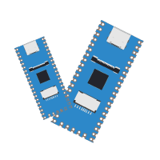

<br />
<div align="center">
  <a href="https://github.com/gonzaloalvarez/aarch-milkduo">
    
  </a>
  <h3 align="center">MilkV Duo work on an M1</h3>
</div>


## About


Most of the documentation and tooling for the MilkV Duo series SBCs is written assuming that you are using
an x86-64 host machine. I generally prefer to use my Apple M1 device to do code editing and so on, so this
is an attempt to build the toolchain and qemu and make it work on an M1 machine.

This generally expands on the work from this milkv community thread:
https://community.milkv.io/t/m1-arm64-debian11-uos-v20/255


## Status

- [x] Compile Toolchain on Apple M1
- [x] Use compiled toolchain to sucessfully build the Duo SDK
- [x] QEmu works and launches the built image
- [x] Compile gen_init_cpio and mkimage natively
- [ ] Support something other than the Duo 256M
- [ ] Make a Dockerfile to build without neededing a QEMU host


## Getting started


1. Install QEMU on your Apple M1 using brew ([how to install brew](https://brew.sh/))
```sh
$ brew install qemu
```
2. Create an Ubuntu 22.04 VM and start it. You can use [UTM](https://mac.getutm.app/). You don't need a full desktop, just the console.
3. Download this repo inside the VM
```sh
$ git clone https://github.com/gonzaloalvarez/aarch-milkduo
```
4. Execute it
```sh
$ ./build.sh duo256
```
5. Go for coffee. Or a long walk. Or both. The first time it takes around 4.5 hours, because building the toolchain is a pretty long process. Even on an M1. Subsequent builds take around 10-15 mins, since you are just building buildroot over and over again.


## References


* [Community MilkV Starting Point for ARM64 Toolchain and SDK Build](https://community.milkv.io/t/m1-arm64-debian11-uos-v20/255)
